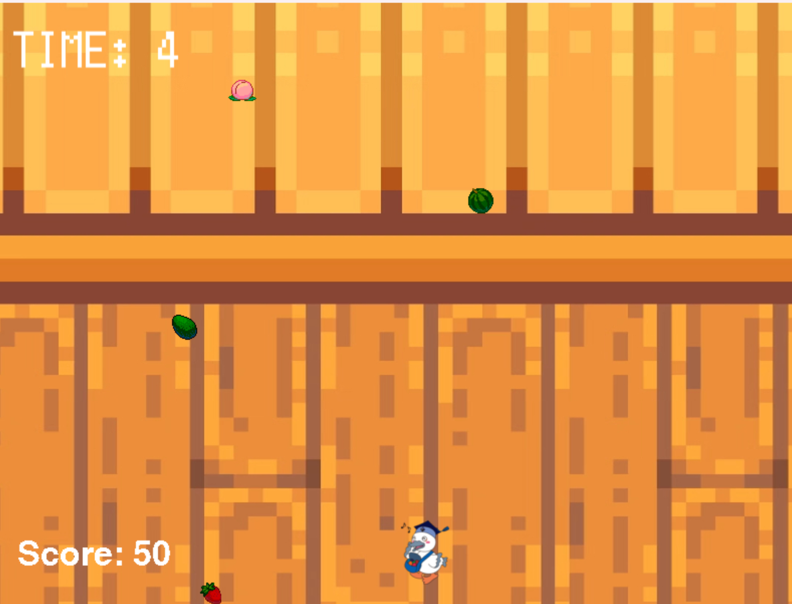

# 落ち物キャッチゲーム

## 実行環境の必要条件
* python >= 3.10
* pygame >= 2.1
* 必要なものがあれば追記してください（非推奨）

## ゲームの概要
* こうかとんを操作して、上から落ちてくるフルーツをキャッチし、スコアを稼ぐゲーム

## ゲームの遊び方
* ゲーム開始：タイトル画面で `SPACE` キーを押すとゲームがスター　トする。
* 操作方法：`←`（左矢印）と `→`（右矢印）キーで、こうかとんを左　右に移動させる。
* 上から落ちてくるフルーツ（良いアイテム）をキャッチするとスコア　が加算（+10点）される。
* アボカド（悪いアイテム）をキャッチしてしまうとスコアが減算　　（-20点）される。
* 制限時間は30秒。

## ゲームの実装
### 共通基本機能
* Pygameの初期化、main()関数の定義、ゲームの状態管理用変数

### 分担追加機能
* こうかとんの動作制御（担当：増田）
  * 矢印キー入力に応じた左右移動と、画面端での移動制限処理。
* 落ちてくるフルーツの制御（担当：シュウ）
  * アイテムのランダム生成、レーンごとの落下処理、一定間隔での出現ロジックの実装。
* 当たり判定とスコア更新（担当：クリスティ）
  * `ScoreManager` クラスを実装。`pygame.Rect.colliderect` を用いてプレイヤー（カゴ）と落下オブジェクトの衝突検知を行う。
  * 取得したアイテムの種類（good/bad）を判定し、スコアをリアルタイムに加減算（0未満にならない安全処理含む）する機能を実装。
* BGMとUI（担当：李）
  * ゲーム中のBGM再生、アイテム取得時・ダメージ時のSE再生機能。
  * 残り時間（TIME）などの画面表示。
* グラフィック（担当：横井）
  * 落ちてくるアイテムの画像設定や背景素材の適用。
* リザルト画面（担当：小嶋）
  * ファイル（`highscore.txt`）へのハイスコア保存・読み込み処理と、タイムオーバー時の画面遷移・スコア表示。

### メモ
* クラス内の変数は，すべて，「get_変数名」という名前のメソッドを介してアクセスするように設計してある
* 複数のクラスにまたがる共通の処理（関数）は、クラスの外で定義し　ている
* ScoreDisplayのクラス内では、スコアを更新する際に      `current_score` 変数を受け取って表示を更新している。

